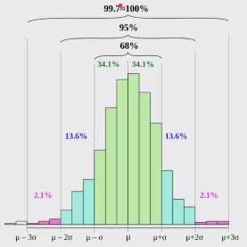

## Stochastic Programming
- Un programa es determinístico si cuando se corre con el mismo input produce el mismo output
- Existen problemas que no pueden ser resueltos por medio de programas determísticos
- La programación Estocástica permite introducir aleatoriedad a nuestros programas para crear simulaciones que permiten resolver otro tipo de problemas
- Los programas estocásticos se aprovechan de que las distribuciones probalisticas de un problema se conocen o pueden ser conocidas
  

## Probability
- Es una medida de la incertidumbre asociada a un evento o suceso futuro. Suele expresarse como un número entre 0 y 1 (0=no sucederá - 1=Sucederá)
- Al hablar de probabilidad preguntamos que fracción de todos los posibles eventos tiene la propiedad que buscamos
- Es necesarios calcular todas las posibilidades o combinaciones de eventos, con el fin de entender su probabilida. Estas posibilidades se calcula mediante los algoritmos:
  - de Aproximación
  - de Enumeración Exhaustiva
- La suma de la probilidad de que un evento **suceda** + la probabilidad de que **no suceda** siempre debe ser $1$
- Leyes de la probabilidad
  - **Ley del complemento**: $P(A)+P(-A)=1$
  - **Ley Multiplicativa**: $P(A y B)=P(A)*P(B)$. *Ejemplo* Cual es la probabilidad de no obtener un 1 en 10 intentos al lanzar un dado:
    - En 1 intento es $\frac{5}{6}=0.8333$, 
    - en 2 intentos es $\frac{5}{6}*\frac{5}{6}=(\frac{5}{6})^2=0.69444$
    - en 10 intentos es $(\frac{5}{6})^{10}=0.1615$
  - **Ley Aditiva**: 
    - $P(A o B)=P(A)+P(B)$ *(Mutuamente Exclusivos)*
    - $P(A o B)=P(A)+P(B) - P(AyB)$ *(No Exclusivos)*

El programa **probability.py**, sirve para calcular la probabilidad de cualquier resultado con dados:
### Por ejemplo la probabilidad de obtener un 12 en 10 tiros
- La probabilidad de **NO** obtener un 12 en un tiro con dos dados es = $\frac{35}{36}$
- La probabilidad de **NO** obtener un 12 en 10 tiros con dos dados es = $(\frac{35}{36})^{10}=0.7545$
- La probabilidad de **SI** obtener un 12 en 10 tiros con dos dados es = $(1-0.7545) =0.2455$

### La probabilidad de obtener un 7 en 10 tiros

- La probabilidad de **NO** obtener un 7 en un tiro con dos dados es = $\frac{6}{36}$
- La probabilidad de **NO** obtener un 7 en 10 tiros con dos dados es = $(\frac{30}{36})^{10}=0.1615$
- La probabilidad de **SI** obtener un 7 en 10 tiros con dos dados es = $(1-0.1615) =0.8385$

## Statistical Inference

- Con las simulaciones pordemos calcular las probabilidades de eventos complejos sabiendo las probabilidades de eventos simples
- Que pasa cuando no sabemos las probabilidades de los eventos simples
- Las técnicas de la statistical inference nos permiten inferir/concluir las propiedades de una poblacion a partir de una muestra aleatoria
- **principio guia de la statistical inference**: Una muestra aleatoria tiende a exhibir las mismas propiedades que la poblacion de la cual fue estraída
- **porque funciona la statistical inference**: por la ley de los **Grandes Numeros**: En pruebas independientes repretidas con la misma probabilidad $P$ de un resultado, la fraccion de desviaciones de $P$ converge a cero conforme la cantidad de pruebas se acerca al infinito. $P(lim_{n\to\infty}\bar{x}_n-\mu)=1$
- La **Falacia del apostador**: 
  - Despues de un evento aleatorio extremo, los siguientes evento probablemente seran menos extremos para nivelar la media
  - la regresion a la media señala que despues de un evento aleatorio extremo, el siguiente evento probablemente será menos extremo

## Media (see statistics.py)
- Es una medida de tendencia central
- Comunmente es conocido como el promedio
- La **media** de una poblacion se denota con el simbolo $\mu$. La media de una muestra se denota con $\bar{X}$
- $\bar{X}=\frac{1}{n}\sum_{i=1}^nx_i=\frac{x_1+x_2+x_3+...+x_n}{n}$

## Varianza y Desviación Standar (see statistics.py)
1. Varianza
   - Mide que tan propagados se encuentra un conjunto de valores aleatorios de su media
   - Mientras la media nos da una idea de donde se encuentran los valores, la varianza nos dice que tan dispersos se encuentran
   - La varianza siempre debe entenderse con respecto a la media
   - $Var(X)=\frac{1}{n}\sum_{i=1}^n(x_i-\mu)^2$. $\mu=\bar{X}$
2. Desviación estándar
   - Permite entender la propagación, y se debe entender siempre relacionado con la **media**.
   - La ventaja sobre la varianza es que la desviación estándar está en las mismas unidades que la media
   - $\sigma=\sqrt{Var(X})$
   - Mientras la desviación estándar sea más pequeña la variabilidad de los datos es menor, la dispersión de los datos es menor. Por ejemplo en una inversión el riesgo sería representado por la desviación estándar.

## Distribucion Normal (or "Gaussian distribution")
1. Es una de las distribuciones más recurrentes en cualquier ámbito
2. Se define completamente por su media y su desviación estándar
3. Permite calcular intervalos de confianza (calcular las probilidades de que suceda algo) con la regla empírica
4. $f(x)=\frac{1}{\sigma\sqrt{2\pi}}e^{-\frac{1}{2}(\frac{x-\mu}{\sigma})^2}$ $:\mu =Media,\sigma=Desviación estándar$

5. Regla Empírica
   - También conocida como **68-95-99.7**
   - Señala cuál es la dispersión de los datos en una distribución normal a uno, dos y tres $\sigma (Desviación Estándar)$ de distancia
   - Permite calcular probabilidades con la densidad de la distribución normal:
     - $Pr(\mu-1\sigma\leq X\leq\mu+1\sigma)\approx0.6827$. La probabilidad de encontrar datos o la densidad de la probabilidad de encontrar datos a 1 Desviación Estándar de la media es $\approx68\%$
     - $Pr(\mu-2\sigma\leq X\leq\mu+2\sigma)\approx0.9545$ $\approx95\%$
     - $Pr(\mu-3\sigma\leq X\leq\mu+3\sigma)\approx0.9973$ $\approx99\%$
6. En esta imagen vemos una representación gráfica de la **Regla Empírica** 
   
7. https://www.webyempresas.com/distribucion-normal-en-estadisticas/
8. https://bookdown.org/aquintela/EBE/ejemplos-de-la-distribucion-normal.html

  