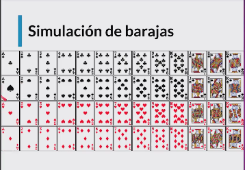
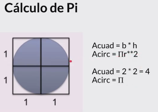
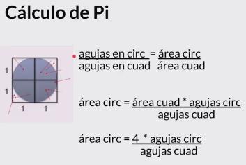

## Simulaciones de Montecarlo

- **Stanisław Marcin Ulam** fue un matemático polaco–estadounidense que participó en el **proyecto Manhattan** y propuso el diseño **Teller–Ulam** de las armas termonucleares. También propuso la idea de propulsión nuclear de pulso y desarrolló un número de herramientas matemáticas en la teoría de números, teoría de conjuntos, teoría ergódica y topología algebraica. Sobre todo es conocido por ser coautor del **método de Montecarlo**.
- Permite crear simulaciones para predecir el resultado de un problema
- Permite convertir problemas determinísticos en problemas estocásticos
- Es utilizado en una gran variedad de áreas, desde la ingeniería hasta la biología y el derecho

## Simulación de Barajas
- Ver programa **barajas.py**, este programa nos entrega la probabilidad de obtener una par en una mano de cartas.
- 

## Calcular $\pi$
- Utilizaremos una tecnica recurrente en las ciencias del computo y las matematicas: Convertir un problema complejo en un problema sencillos, que sabemos como resolver
- Para calcular $\pi$, utilizaremos el metodo de aventar muchas agujas de manera aleatoria y determinar cuantas agujas caen adentro del circulo y cuantas dentro del cuadrado.
- Suponiendo que el cuadrado es de lado $l=2$  

- La proporción de agujas que caen dentro del circulo y dentro del cuadrado, es la misma proporción que hay entre las áreas del circulo y del cuadrado.  

- Con este metodo obtenemos una solución estadísticamente válida  
- En el programa **pi.py**, implementamos la solucion estadistica de las agujas
- En la funcion `def estminar_pi(...)` del programa **pi.py**, mas exactamente en esta línea `while sigma >= precision / 1.96:`, creo que esta condición se deduce del siguiente análisis de la fórmula de **la regla empírica**. 
  - $Pr(μ−1.96σ≤X≤μ+1.96σ)\approx95\%$ $:$ lo que se desea es que $X=\mu\pm0.01$ Reemplazando $X$ por $(\mu+0.01)$, en la parte positiva obtenemos que $(\mu+0.01≤μ+1.96σ)$, despejando $\sigma$ tenemos $\sigma>=\frac{0.01}{1.96}$

