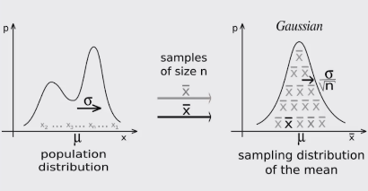

## Sampling
1. El **muestreo** es muy importante cuando no tenemos acceso a toda la población que queremos explorar. 
2. Uno de los grandes descubrimientos de la estadística es que las muestras aleatorias tienden a mostrar las mismas propiedades de la población objetivo.
3. Hasta este punto todos los **muestreos** que hemos hecho son de *tipo probabilísticos*, estos tienen dos formas:
   - **Muestreo Aleatorio**: cualquier miembro de la población tiene la misma probabilidad de ser escogido.
   - **Muestreo Estratificado**: tomamos en consideración las características de la población para partirla en subgrupos y luego tomamos muestras de cada subgrupo.
     - Incrementa la probabilidad de que el **muestreo** sea representativo de la población.
4. A mas muestras la $\mu$ **será más precisa**
5. A tamaños de muestras mas granades la $\sigma$ **será más pequeña**

## Central Limit Theorem
1. Es uno de los teoremas más importantes de la estadística
2. Establece que muestras aleatorias de cualquier distribución van a tener una distribución normal.
3. Permite entender cualquier distribución como la distribución normal de sus medias y eso nos permite aplicar todo los que sabemos de distribuciones normales.
4. Mientras mas muestras obtengamos, mayor será la similitud con la distribución normal
5. Mientras la muestra sea de mayor tamaño la $\sigma$ será menor.    
6. Una forma de Visualizar el **Central Limit Theorem**
      
   - Del lado izquierdo tenemos una muestra binominial (dos picos) la cual tiene una $\mu$ y una $\sigma$.
   - Podemos generar samples (muestras) de size N (la media de un sample se representa por $\bar{x}$) y esto nos empezará a generar una distribución normal.
7. Este programa http://195.134.76.37/applets/AppletCentralLimit/Appl_CentralLimit2.html, demuestra como cualquier distribución puede ser convertida en una distribución normal. 